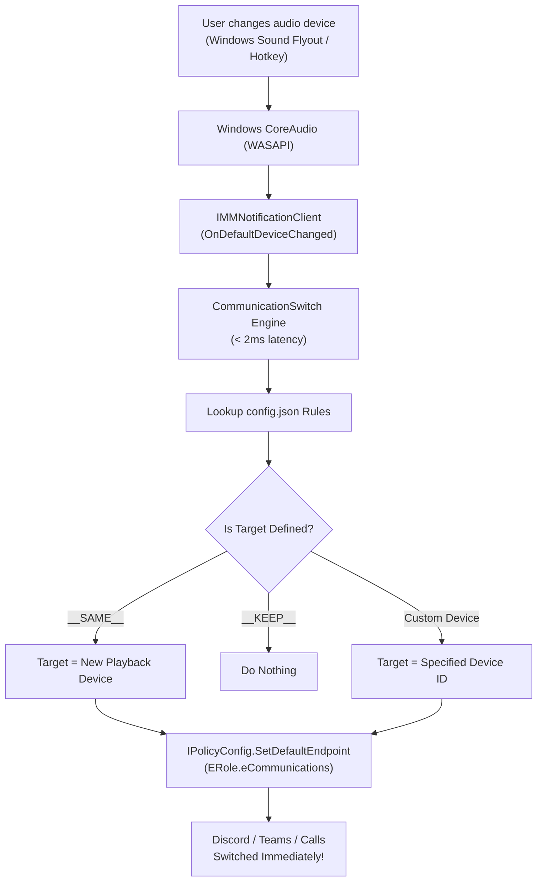

# Communication Switch 🎧🔄

[](https://github.com)
[](https://github.com)
[](LICENSE)
[](https://github.com)

**Communication Switch** is a lightweight, zero-latency Windows utility that automatically routes your **Default Communication Output Device** whenever you change your **Default Playback Device**.

---

## 🎯 The Problem

In Windows, audio is split into two roles:
1. **Default Playback Device**: Used by games, web browsers, YouTube, and media players.
2. **Default Communication Device**: Used by Discord, Microsoft Teams, Zoom, game voice chats, and VoIP software.

When you switch your audio output device using the Windows volume flyout or Windows Settings, Windows often **leaves your communication device stuck** on an older or unintended output. 

For example, when you switch to your **Speakers** to play music, you may not want your private Discord or call audio suddenly blasting through your room's speakers!

**Communication Switch** gives you complete control over this behavior with an intuitive GUI and reactive background automation.

---

## ✨ Features

- ⚡ **Zero-Latency Event Detection**: Implements native Windows CoreAudio `IMMNotificationClient` COM interfaces. Switching takes less than **2 milliseconds** with **0% CPU** consumption while idle (no polling loops!).
- 🎛️ **Intuitive Configuration GUI**: Detects all connected audio hardware and gives you simple dropdowns to route any output device to any communication device.
- 🔀 **Flexible Routing Modes**:
  - **Mirror Mode**: Synchronize Communication to always match Output (`Same as Output`).
  - **Custom Target**: Route specific outputs to designated devices (e.g. `Speaker` &rarr; `Headphone`).
  - **Exclude / Hold**: Leave communication untouched when a specific output is chosen (`Do Not Change`).
- 🚀 **1-Click Autostart**: Enable/disable automatic launch on Windows boot directly from the preferences menu.
- 📌 **System Tray Integration**: Sits discreetly in your taskbar system tray with a right-click context menu, status badges, and optional balloon notifications.
- 📦 **Zero External Dependencies**: Single `.exe` (~50 KB) that runs out-of-the-box on every Windows 10 and Windows 11 PC without installing runtimes, packages, or frameworks.

---

## 🖥️ User Interface Preview

```text
+-----------------------------------------------------------------------+
|  Communication Switch                                                |
|                                                                       |
|  [● ACTIVE MONITORING]                                               |
|  Default Playback Output: Speaker (USB PnP Sound Device)             |
|  Default Communication:   Headphone (FANTECH CAPTAIN 7.1)             |
+-----------------------------------------------------------------------+
|  Device Routing Rules                                                 |
|  When you switch your Output device, choose the Communication device: |
|                                                                       |
|  Speaker (USB PnP)           ➜  [ Headphone (FANTECH CAPTAIN)     ▼ ] |
|  Earphone (Realtek Audio)    ➜  [ Same as Output (Mirror)          ▼ ] |
|  Headphone (FANTECH)         ➜  [ Same as Output (Mirror)          ▼ ] |
|  Any other / Future device   ➜  [ Same as Output (Mirror)          ▼ ] |
+-----------------------------------------------------------------------+
|  Preferences                                                          |
|  [x] Start automatically when Windows starts (Run on startup)         |
|  [x] Minimize to System Tray when closing the window                  |
|  [ ] Show notification popup when communication device switches       |
+-----------------------------------------------------------------------+
|           [View Logs]  [Pause Monitor]  [Refresh]  [Save & Apply Rules|
+-----------------------------------------------------------------------+
```

---

## 🚀 Getting Started

### Option 1: Download & Run
1. Download **`CommunicationSwitch.exe`** from the [Releases](https://github.com/PallabKumarS/communication-audio-switch/releases) tab.
2. Place it in any folder of your choice (e.g. `C:\Program Files\Communication Switch` or your user folder).
3. Double-click **`CommunicationSwitch.exe`** to open the configuration window.
4. Select your desired routing rules in the dropdowns.
5. Check **"Start automatically when Windows starts"** and click **"Save & Apply Rules"**.
6. Close the window — the app will quietly sit in your system tray and handle switching in the background!

---

## 🛠️ Building From Source (1-Click)

You don't need Visual Studio installed to build this project! Every copy of Windows 10 and 11 includes the native Microsoft .NET Framework C# compiler (`csc.exe`).

1. Clone or download this repository:
   ```cmd
   git clone https://github.com/PallabKumarS/communication-audio-switch.git
   cd communication-audio-switch
   ```
2. Double-click **`build.bat`** (or run it from CMD/PowerShell):
   ```cmd
   build.bat
   ```
3. The standalone **`CommunicationSwitch.exe`** executable will be compiled in seconds.

---

## ⚙️ Configuration File (`config.json`)

The application automatically stores its rules in `config.json` alongside the executable (or in `%APPDATA%\CommunicationSwitch\` if installed in a protected location).

Example `config.json`:
```json
{
  "AutoStart": true,
  "MinimizeToTray": true,
  "ShowNotifications": false,
  "IsMonitoring": true,
  "DefaultFallback": "__SAME__",
  "DeviceMappings": {
    "Speaker": "Headphone",
    "Earphone": "__SAME__",
    "Headphone": "__SAME__"
  }
}
```

### Routing Actions:
- `__SAME__`: Mirrors the communication device to match the newly selected playback device.
- `__KEEP__`: Keeps the communication device unchanged.
- `<Device Name>`: Routes communication to the device whose name contains this text (e.g. `"Headphone"`).

---

## 💻 CLI Commands (For Power Users & Scripts)

The application also includes command-line options:

```powershell
# Open the configuration GUI (default)
.\CommunicationSwitch.exe

# Start minimized directly to the System Tray (used by autostart)
.\CommunicationSwitch.exe --tray

# Query current device assignments and active endpoints
.\CommunicationSwitch.exe --status

# Execute a self-test sequence
.\CommunicationSwitch.exe --test

# Terminate any running background instance
.\CommunicationSwitch.exe --stop
```

---

## 🔬 How It Works (Architecture)



1. **`IMMDeviceEnumerator` & `IMMNotificationClient`**: Subscribes directly to audio subsystem events without polling.
2. **`IPolicyConfig` COM Interface**: Activates the desired `ERole.eCommunications` endpoint programmatically.
3. **Single-Instance Mutex**: `Global\CommunicationSwitch_Unique_Mutex_7324ce48` ensures only one instance runs.
4. **Apartment-Safe COM**: Each worker thread dynamically acquires an isolated COM client instance to prevent cross-apartment deadlocks.

---

## 👤 Author

**Pallab Kumar Sarker**
- GitHub: [@PallabKumarS](https://github.com/PallabKumarS)

---

## 📄 License

This project is licensed under the [MIT License](LICENSE) - free for personal and commercial use.
